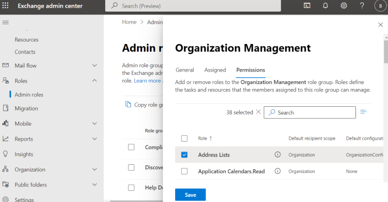
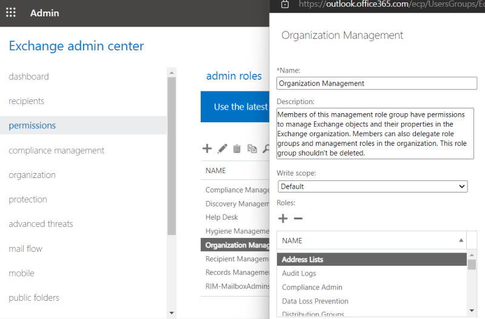

# 使用 Powershell 搭配 EXO v3 管理 Exchange Online 通訊清單

在企業內部有佈署 Exchange Server 的管理者，為了讓使用者能夠依據部門定義階層，方便企業人員尋找通訊錄中的信箱使用者，通常都會在 ECP 中透過通訊清單的功能去設定，但在移轉至 Exchange Online 後，發現無法使用網頁介面去設定，沒想到 Exchange Online 發展了這麼多年，這個功能依然還沒加到系統管理中心，還是只能使用 PowerShell 連線至 Exchange Online 進行設定。此篇就是教您如何透過 PowerShell 搭配 EXO V3 module 來建立通訊清單，Exchange Online 在此篇會以 EXO 縮寫表示。 

## 連線至 Exchange Online PowerShell

微軟在 2021 年 9 月的時候，公告了在 2022 年 10 月 1 日起，停用在 EXO 中的基本驗證，連帶影響的有 Outlook、EWS、RPS、POP、IMAP 和 EAS，其中也包括了 Powershell EXO V2 module 所採用的基本驗證連線方式，所以本篇會以 EXO V3 Module，來連線至 Exchange Online。 

- 在開始執行指令連線之前，我們先指派必要的權限，開啟Exchange Online系統管理中心，至權限分類中，選擇Oranization Management，並在角色欄位中新增Address Lists。然而 Exchange Admin Center 面臨到介面變更的狀況，所以我也會提供兩種介面的截圖給大家參考。 
  - 新介面 
     
  - 傳統介面 
     
- 前置作業檢查： 
  - 如果您使用 Windows Client: Windows 7 Service Pack 1 (SP1)、Windows 8.1、Windows 10/11 
  - 如果您使用 Windows Server: Windows Server 2008 R2 SP1、Windows Server 2012/R2 或更新版本 
  - 確認您的環境已安裝 Microsoft .NET Framework 4.7.1 
- 使用`系統管理員身分`開啟您本機電腦的 Windows Powershell 或是 Windows Powershell ISE，依據您熟悉的工具使用即可，本篇會使用 Windows Powershell ISE，原因是在定義通訊清單的時候，有指令碼窗格會減少蠻多重複剪貼的工作。 
- 開啟之後，執行 `Set-ExecutionPolicy RemoteSigned` 將 PowerShell 執行原則設定為 RemoteSigned，否則您會看到錯誤。 
- 完成後，執行 `Install-Module -Name ExchangeOnlineManagement` 安裝最新的 EXO 模組，也提供幾個指令可以進行選用。 
  - 查看目前安裝的模組版本及其安裝位置 `Get-InstalledModule ExchangeOnlineManagement | Format-List Name,Version,InstalledLocation` 
  - 更新模組 `Update-Module -Name ExchangeOnlineManagement` 
- 輸入 `Connect-ExchangeOnline -UserPrincipalName brian@M365B259147.onmicrosoft.com` 連線至 EXO，請將 UserPrincipalName 後面的帳號，輸入具有權限的帳號，通常來說可能是全域管理員，執行後會跳出帳號密碼登入的視窗，登入即可。 
  
- 執行`Get-EXOMailbox`確認是否已成功連線。 

## 通訊清單管理

通訊清單主要是為了讓使用者可以對應企業部門的階層分類，快速找到對應的信箱使用者。在 EXO 環境中，常見的情境會有以下兩種： 
情境 1：信箱使用者未存在：先建立通訊清單，在建立信箱使用者。 
情境 2：信箱使用者已存在：建立通訊清單，更新使用者資料。例：通訊清單已部門篩選人員，使用者部門已有相對應值，必須先將其更改，再改回原本相對應值，聯絡人才會在相對應分類出現。如果環境中有使用身分混合識別，需要透過執行 AAD Sync 手動同步指令，更改過的通訊清單才會正常篩選。 

- 新增 Address List
  假如我們今天要建立的通訊清單階層是：
    Contoso 
    |_部門1 
        |_業務單位 
        |_技術單位 
    |_部門2 
- 查詢 Address List
- 更改 Address List名稱
- 更改 Address List過濾屬性
- 刪除 Address List

## 參考來源

- [Basic Authentication and Exchange Online – September 2021 Update](https://techcommunity.microsoft.com/t5/exchange-team-blog/basic-authentication-and-exchange-online-september-2021-update/ba-p/2772210) 
- 